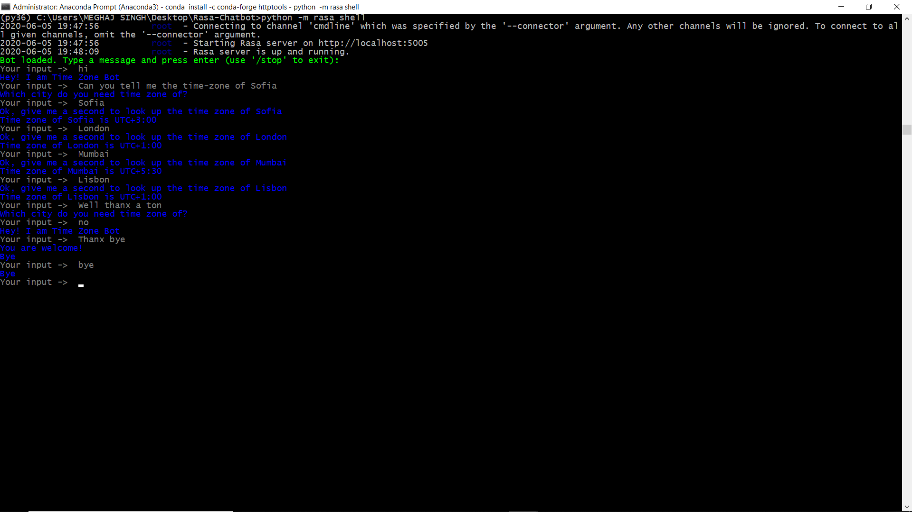

# Rasa_ChatBot

This is a simple chatbot created by me while trying to follow and learn through a Coursera guided Project Course : <a href="https://www.coursera.org/projects/chatbot-rasa-python?">Rasa-Chatbot</a>

Main objectives were to study about :-

1. `Contextual Assistants`.

2. `Pyhton Programming`.

3. `ChatBot Development`.

4. `Rasa`.

Following functionalities/modules were used by me during the process:-

1. `Numpy`.

2. `Rasa`.

3. `Python 3.7`.

4. `TensorFlow`.

5. `Scikit-learn`.

Currently the ChatBot is capable of answering :-

1. Basic questions/exchange greetings.

2. Tell time-zones of the recorded cities 'only'.

To modify or add more Time-Zones, you can add an API to the `action.py` file or store the same in a python dictionary created in the same file.

